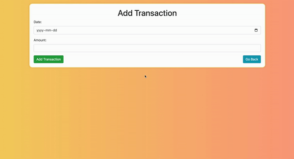
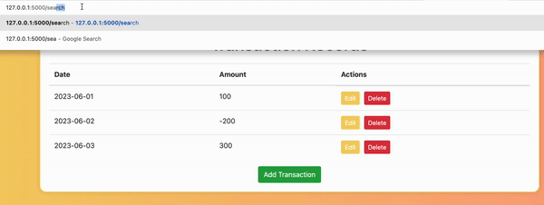
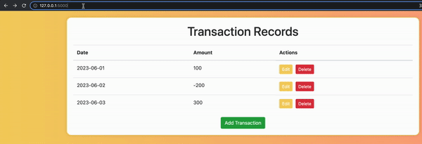

# CRUD Application Design using Additional Features in Flask

This project is an assignment from the **"Developing AI Applications with Python and Flask"** course by IBM. It is a financial transaction recording system that allows users to **Create, Read, Update, and Delete (CRUD)** transaction entries.

## Overview

The application consists of three main web pages:

1. **Transaction Records**  
   - Displays all recorded transactions.  
   - Provides options to **Edit** and **Delete** entries.  
   - Allows users to **add** new transactions.  

2. **Add Transaction**  
   - Navigated to when the user chooses to add a new transaction.  
   - Requires **Date** and **Amount** inputs.  

3. **Edit Transaction**  
   - Accessed when the user selects the **Edit** option for an existing entry.  
   - Allows modifying the **Date** and **Amount** fields.  
   - Updates the transaction corresponding to the selected **ID**.  

## Demonstration

Below are three GIFs showcasing key features of the application:

1. **CRUD Operations** – Creating, reading, updating, and deleting transactions.  
   

2. **Search Transactions** – Quickly find specific transactions.  
   

3. **Total Balance** – Displays the total sum of all recorded transactions.  
   

---
